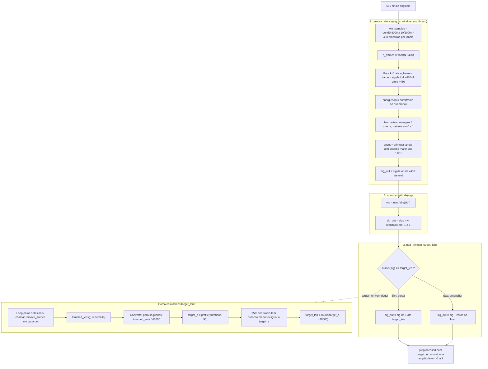

# Ponto 4 – Pré-processamento dos Sinais

## Objetivo
Antes de extrair características dos sinais, é necessário garantir que todos estão numa forma comparável:
1. **Remover o silêncio inicial** — todos os sinais devem começar no onset da fala
2. **Normalizar a amplitude** — eliminar diferenças de volume entre gravações
3. **Uniformizar a duração** — todos os sinais devem ter o mesmo número de amostras

---

## Parâmetros

| Parâmetro | Valor | Significado |
|---|---|---|
| `fs` | 48000 Hz | 48000 amostras por segundo |
| `WINDOW_MS` | 10 ms | Cada janela tem 10 milissegundos de duração |
| `win_samples` | 480 amostras | `48000 × (10/1000) = 480` amostras por janela |
| `ENERGY_THRESH` | 0.001 | Limiar de energia: 0.1% da energia máxima |
| `target_len` | 36048 amostras | Percentil 95 das durações após remover silêncio (~0.75s) |

---

## Diagrama

---

## Explicação passo a passo

### 1. `remove_silence` — Remover silêncio inicial

O sinal é dividido em **janelas de 10ms (480 amostras)**. Para cada janela calcula-se a **energia** (soma dos quadrados das amostras):

$$E_k = \sum_{n} x[n]^2$$

As energias são normalizadas pelo máximo para ficarem entre [0, 1]. A **primeira janela** cuja energia ultrapassa 0.1% da energia máxima é considerada o **onset da fala** — o momento em que a pessoa começa a falar. Tudo antes desse ponto é silêncio e é removido.

**Porquê janelas de 10ms?** É curto o suficiente para detectar o onset com precisão (±10ms), mas longo o suficiente para calcular uma energia estável.

---

### 2. `norm_amplitude` — Normalizar amplitude

Divide todas as amostras pelo valor máximo absoluto do sinal:

$$x_{norm}[n] = \frac{x[n]}{\max(|x|)}$$

Isto garante que todos os sinais têm amplitude entre **[-1, 1]**, independentemente do volume da gravação original (distância ao microfone, volume da voz, etc.).

---

### 3. `pad_trim` — Uniformizar duração

A duração alvo (`target_len = 36048` amostras ≈ 0.75s) é o **percentil 95** das durações após remover silêncio — cobre 95% dos sinais sem que um outlier longo distorça tudo.

- Se o sinal for **mais longo**: corta no final
- Se o sinal for **mais curto**: adiciona zeros no final (silêncio)

Os zeros adicionados no final não afectam o conteúdo de fala, pois a fala já terminou antes.
